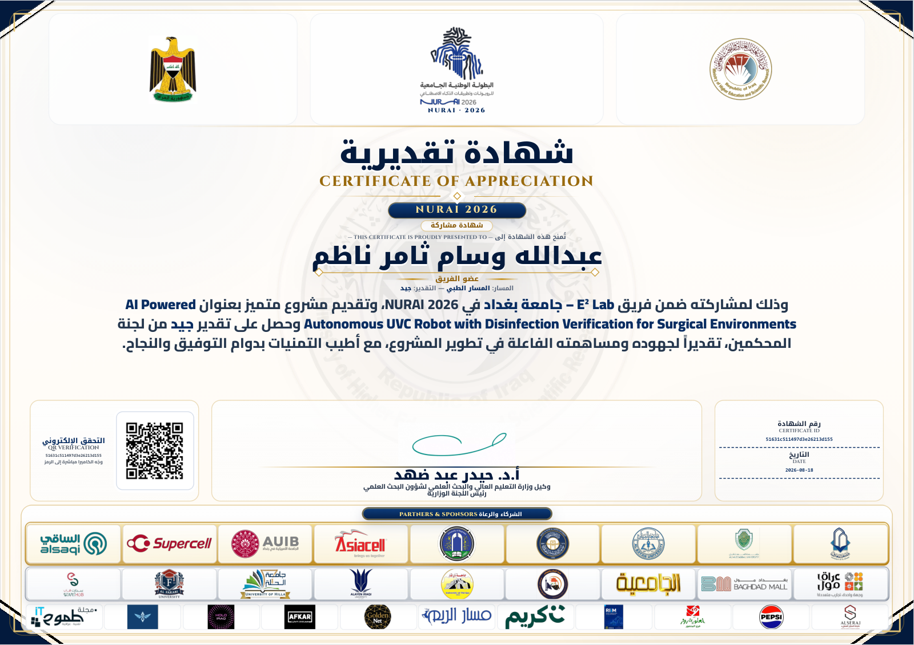

# the_robot — Autonomous UV-C Disinfection Robot

An autonomous **UV-C disinfection robot** built with **ROS 2** on **Linux**. It is
designed to navigate indoor environments (e.g. hospital rooms and surgical
theatres), map them, drive to target locations, and switch a UV-C lamp on to
disinfect surfaces — all while a safety layer keeps it from crashing into
obstacles.

The full system runs both in **simulation** (Gazebo, TurtleBot3 Waffle base) and
on **real hardware** (Raspberry Pi + motor driver, ultrasonic sensor, and a
relay-driven UV-C lamp).

---

## 🏆 NURAI 2026

This project was developed for **NURAI 2026** — the Iraqi *National University
Championship for Robotics and Artificial Intelligence Applications* (البطولة
الوطنية الجامعية للروبوتات وتطبيقات الذكاء الاصطناعي), hosted by the **Iraqi
Ministry of Higher Education and Scientific Research**.

- **Team:** E² Lab — University of Baghdad
- **Track:** Medical Track
- **Project:** *AI-Powered Autonomous UVC Robot with Disinfection Verification for Surgical Environments*
- **Result:** Participated, presented the project, and was awarded a **Certificate
  of Appreciation**, rated **"Good"** by the judging committee.

### Certificate



The certificate can be verified online through the official NURAI system:
👉 https://nurai.utq.edu.iq/make_certificate.php?q=AAABtAMAAAYhUWMcURSX0-JiE9FV
(Certificate ID: `51631c511497d3e26213d155`)

---

## 👤 Authorship & contributions

The entire software stack in this repository was designed, written, and tested by
me, **Abdullah Wisam Thamer Nazim**. Within the E² Lab team the work was divided:
my teammates were responsible for building the physical hardware, while the
complete software side was my sole responsibility — every ROS 2 node, launch
file, and all of the navigation, mapping, safety, and control logic. The full
system was developed and validated in simulation (Gazebo).

---

## ✨ Features

- **Simulation** in Gazebo with a hospital world and a TurtleBot3 Waffle base.
- **Mapping** with SLAM (`slam_toolbox`).
- **Autonomous navigation** with Nav2 (map server, AMCL, planners) on a saved map.
- **Collision guard** — an HC-SR04 ultrasonic safety gate that blocks forward
  motion before the robot hits an obstacle (reverse/turn still allowed).
- **UV-C lamp control** via a Raspberry Pi GPIO relay, defaulting to OFF for
  safety (UV-C is hazardous to skin and eyes).
- **Manual control** — WASD keyboard teleop and a **browser-based** goal/teleop
  interface.
- **Wheel odometry** and a URDF robot description.

---

## 🧱 Tech stack

- **ROS 2** (`ament_python` package) on **Ubuntu Linux**
- **Gazebo** + **TurtleBot3** (simulation)
- **Nav2** and **slam_toolbox** (navigation & mapping)
- **Python** (`rclpy`) for all nodes
- **Raspberry Pi** GPIO (`gpiozero`) for the real robot (motors, UV lamp, HC-SR04)

---

## 📂 Repository layout

```
the_robot/          ROS 2 Python nodes
  ├─ run_gazebo.py / spawn_robot.py   launch Gazebo & spawn the robot
  ├─ slam.py                          run SLAM mapping
  ├─ nav2_goal.py / web_goal.py       send navigation goals (CLI / browser)
  ├─ teleop_wasd.py / web_teleop.py   manual driving (keyboard / browser)
  ├─ collision_guard.py               ultrasonic safety gate
  ├─ motor_driver.py                  L298N motor driver (Raspberry Pi)
  ├─ ultrasonic_hcsr04.py             HC-SR04 distance sensor driver
  ├─ uv_switch.py                     UV-C lamp relay control
  └─ wheel_odometry.py                wheel odometry
launch/             ROS 2 launch files (sim, nav2, real-robot base, ultrasonic)
config/             SLAM config + saved navigation goal
urdf/               robot description (xacro)
```

---

## 🚀 How to run

> Prerequisites: a working **ROS 2 + Gazebo + TurtleBot3 + Nav2** setup on Ubuntu.
> Set the TurtleBot3 model before launching:
> ```bash
> export TURTLEBOT3_MODEL=waffle
> ```

**1. Build the package** (in your ROS 2 workspace):

```bash
colcon build --packages-select the_robot
source install/setup.bash
```

**2. Simulation only** — Gazebo + the robot:

```bash
ros2 launch the_robot sim.launch.py
```

**3. Full navigation stack** — Gazebo + Nav2 + RViz on the hospital map:

```bash
ros2 launch the_robot nav2.launch.py
```

**4. Drive it manually:**

```bash
# keyboard (WASD)
ros2 run the_robot teleop_wasd

# or from a browser
ros2 run the_robot web_goal      # then open http://localhost:8080
```

**5. UV-C lamp (real robot only):**

```bash
ros2 run the_robot uv_switch                          # starts OFF (safe default)
ros2 param set /uv_switch on true                     # turn the lamp ON
```

### Real robot (Raspberry Pi)

The real robot adds a safety chain (ultrasonic → collision guard → motor driver):

```bash
ros2 launch the_robot guarded_base.launch.py
```

This requires the Raspberry Pi GPIO backend (`python3-gpiozero python3-lgpio`)
and is not needed for simulation.

---

*Developed by Abdullah Wisam Thamer Nazim ([@Abd-source-main](https://github.com/Abd-source-main)) for NURAI 2026.*
